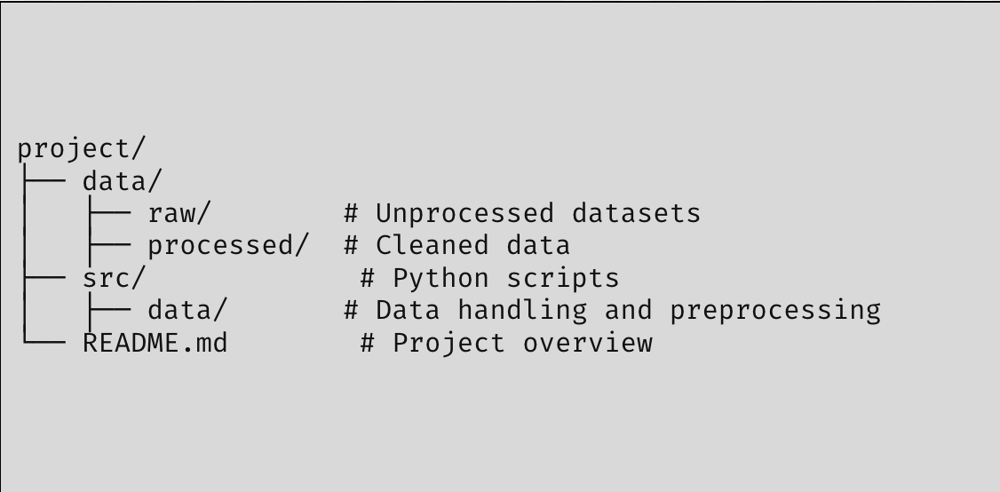

# Error404 DataThon Deliverables 

## Description
The flourishing of the Singapore economy is a double-edged sword. Though the outside world view us as a burgeoning financial hub, the efforts to safeguard our nation grow exponentially. Facing major threats in cyberspace, terrorism, radicalism and financial governance, it is sacrosanct for Singapore to monitor potential threats from both external and internal forces. 

Therefore, collaborations between the defence and IT realm is vital to maintain a safe space for Singaporeans. Through robust analysis of all sorts of data, both unstructured and structured, defence agencies in Singapore can uncover hidden insights and connections between people to hit their KPIs, namely resource allocation, mission planning and security monitoring. 

As such, our team will be embarking on a journey of defence-analytics to uncover hidden relationships within an unstructured textual database, to optimise goals for ISD. 

## Deliverables
In this hackathon, we were required to build an analytics tool which leverages visual aids, e.g. various charts, to derive data-driven actionable insights for ISD. 
## Datasets
We were provided the `wikileaks database`, alongside a `news_excerpt` textual database. 

## Repository Structure

## Walkthrough 
1) Explored the textual database  
2) Started by finding out relationships between `news_excerpts` and `wikileaks`, obtaining similarity scores between them 
3) Conducted data cleansing via tokenisation, text-preprocessing 
4) Used NER (Named Entity Recognition) methodologies to get common entities and entity types. 
5) Obtained main themes for each document/wikileak, e.g. emotions/themes revolving around respective articles 
6) Created destination tables to input into Tableau 
7) Built Tableau Dashboard for insights-derivation 

You can view the Tableau Dashboard in the following link: 
[Articles Dashboard](https://public.tableau.com/app/profile/wei.lun.cheng/viz/DataThon_17383164387390/Story1)